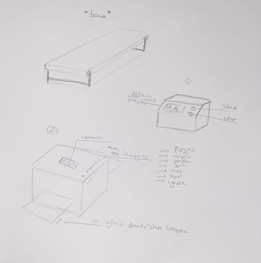

# Functional requirements document
Classifying Plastics
Because reuse isn’t throwing away.

**Authors**

Robert Boudewijn	631286
Nadine Fikke		630548
Shinichi Hezemans	2116460
	
 

**Publication date**

00 month 2022

 

**Project group**

EVML 5 -  classifying plastics 2
	
 

**Status**

Under edit

 

**Version**

0.0.2

 

**Education**

HBO Bachelor

HAN University of Applied Sciences

HAN AEA 
	
 

**Semester**

Embedded Vision Design and Machine Learning

 

**Project supervisors**

Mr. H. Arends	

 

**Clients**

Circular Lab

Mr. L. Gennari

Mr. A. Hendriks 

## Introduction
In this document we will describe the functional requirements of the project.

### Overall Description 
This document describes the requirements for the project “Plastic recognition with AI”. The goal of this project is to classify different types of plastics with the help of computer vision artificial intelligence (AI). For more information about the project, please see the Plan of approach.

### Operating Environment 
The machine will be used in the Circular Lab of the HAN Academy of Engineering and Automotive. This machine will be placed in the Circular Lab, where it will be used to classify the plastic waste.

The classifying will be done with an raspberry pi 3b +. This raspberry pi will be connected to a camera or sensor, which will be used to take pictures of the plastic waste. The pictures will be send to the raspberry pi, where the AI will classify the plastic waste.

### Design and Implementation Constraints 
<!-- Describe any items or issues that will limit the options available to the developers. These might include: hardware (e.g. specific mobile platforms), specific technologies, tools, and databases to be used; interfaces to other applications; programming language required; or communications protocols -->
There are a number of constraints that the development team must adhere to;

- The client wants that the classification machine must be able to classify the plastic waste in 5 different types of plastic.
- The machine must be able to classify the plastic waste in real time and with that result should control an actuator.

### Product Functions 
<!-- Summarize the major functions the product must perform or must let the user perform. Details will be provided in Section 3, so only a high level summary is needed here. In most cases, this section will primarily contain a use case diagram and brief use case descriptions -->

The machine must control the conveyor belt, camera and an actuator. With these 3 components the machine must be able to classify the plastic waste in 5 different types of plastic. The conveyor belt will be used to move the plastic waste to the camera. The camera will be used to take pictures of the plastic waste. The actuator will be used to move the plastic waste to the right bin, depending on the type of plastic.

## 1. Functional Requirements
The following functional requirements are needed to achieve the goal of this project, these requirements are SMART formulated (SMART criteria, 2020) and ordered with the MoSCoW method (SMART criteria, 2020).

| Code | Priority | Description |
| :--- | :--- | :--- |
| FR-01 | Must | The product must classify two types of plastics. |
| FR-02 | Must | The predictions of the product must be at least 70% accurate. |
| FR-03 | Must | The product must classify a plastic within 60 seconds. |
| FR-04 | Should | The product should be able to classify 5 types of plastics. |
| FR-05 | Should | The product should be able to classify a plastic within 10 seconds. |
| FR-06 | Could | The product could be able to classify 10 types of plastics. |

## 2. Non-functional Requirements
The following requirements are not functional. This includes usability, reliability, performance and supportability. We have elaborated this on the basis of FURPS+ (PSPlus, n.d.) with SMART objectives (SMART criteria, 2020) and MoSCoW prioritization (MoSCoW Prioritization, n.d.).

### 2.1 Usability 
<!-- 
Human factors
Aesthetic properties
Consistency
Documentation
-->
Usability requirements are about how easy it is to use the application and the amount of documentation needed to use the application.

| Code | Priority | Description |
| :--- | :--- | :--- |
| NFU-01 | Must | The product must be easy to turn on. (For example only plugging in the power and/or pressing an button) |
| NFU-02 | Must | The product must have a quick start guide, which explains how to operate the product. |
| NFU-03 | Should | The product should have a user manual, which explains the total functionalities of the product. |

### 2.2 Reliability
<!--
Failure frequency
Impact of failure
recoverability
Predictability
Accuracy
Average time between disturbances
-->
Reliability requirements are about how often the application crashes and how long it takes to recover from a crash.

| Code | Priority | Description |
| :--- | :--- | :--- |
| NFR-01 | Must | The product must not crash, when the product is used as intended. |
| NFR-02 | Must | The product must scan plastics with a minimum of 70% accuracy. |
| NFR-03 | Would | Any errors that occur would be logged. |

### 2.3 Performance
<!--
Speed
Efficiency
Resource consumption
Transit
Response time
 -->
Performance requirements are about how fast the application is and how much resources it uses.

| Code | Priority | Description |
| :--- | :--- | :--- |
| NFP-01 | Must | The product must classify a plastic within 60 seconds. |
| NFP-02 | Should | The conveyor belt speed should be able to be adjusted by an admin. |
| NFP-03 | Should | The product should classify a plastic within 10 seconds. |
| NFP-04 | Could | The product could classify a plastic within 5 seconds. |

### 2.4 Supportability
<!--
Testability
Extensibility
Customizability
maintainability
Connectivity
adjustability
Usability
Installability
Definability of place
Portability
-->
Supportability requirements are about how easy it is to maintain the application and how easy it is to add new features.

| Code | Priority | Description |
| :--- | :--- | :--- |
| NFS-01 | Must | The physical product must be able to be maintained (cleaned, repaired, etc.) by the client. |
| NFS-02 | Must | The building steps of the product must be documented and reproducible for other people. |

## 3. User interface sketches
<!--
Provide low-fidelity user interface sketches. Map the sketches to use cases and other requirements if applicable.
 -->
### 3.1 option 1 

### 3.2 option 2
Another option is a web application where you can view various 'stats' and see what the camera sees in real time. You can also set the speed of the conveyor belt in this application. The product will simply turn on by plugging in a plug/a simple on off button. This button also counts as an emergency stop button. As soon as the system has power it will start up and the status will be shown by 3 different LEDs:
1. power
2. internet
3. software is on.

Leds 2 and 3 may come on at different times.
As soon as the software is turned on, the tape will spin and start classifying.
## Conclusion
In this document we have described the requirements for the project “Plastic classification with computer vision”. The goal of this project is to classify different types of plastics with the help of computer vision artificial intelligence (AI). For more information about the project, please see the Plan of approach.

## References
MoSCoW Prioritization. (sd). Opgehaald van ProductPlan: https://www.productplan.com/glossary/moscow-prioritization/
PSPlus. (sd). Think you’ve got your requirements defined? Think FURPS! Opgehaald van psplus.ca: https://www.psplus.ca/articles/think-youve-got-your-requirements-defined-think-furps/
SMART criteria. (2020, 05 14). Opgehaald van wikipedia: https://en.wikipedia.org/wiki/SMART_criteria

